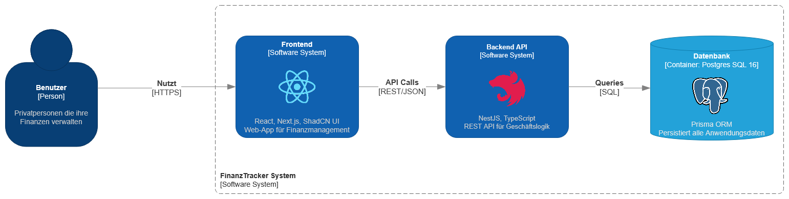

= Architecture Notebook: FinanzTracker
Ben Eisold (s87191<at>htw-dresden.de); Paula Grahlow (s86261<at>htw-dresden.de); Ahmad Ali Nabizada (s87068<at>htw-dresden.de);  Tuan Khang Pham (s87088<at>htw-dresden.de); Christoph Prasser (s87530<at>htw-dresden.de); Cedrick Richter (s87073<at>htw-dresden.de); Elias Blume (s87142<at>htw-dresden.de) 
{localdatetime}
include::../_includes/default-attributes.inc.adoc[]
// Platzhalter für weitere Dokumenten-Attribute

== Zweck
Dieses Dokument beschreibt die Philosophie, Entscheidungen, Nebenbedingungen, Begründungen, wesentliche Elemente und andere übergreifende Aspekte des Systems, die Einfluss auf Entwurf und Implementierung der plattformübergreifenden FinanzTracker-App haben. Ziel ist es, eine wartbare, performante und benutzerfreundliche Anwendung zu erstellen, die auf Desktop und mobilen Endgeräten über eine einheitliche Codebasis zugänglich ist.
//Hinweise: Bearbeiten Sie immer die Abschnitte 2-6 dieser Vorlage. Nachfolgende Abschnitte sind empfohlen, aber optional und sollten je nach Umfang der künftigen Wartungsarbeiten, Fähigkeiten des Entwicklungsteams und Bedeutung anderer architektureller Belange.

//Anmerkung: Die Architektur legt wesentliche EINSCHRÄNKUNGEN für den Systementwurf fest und ist ein Schlüssel für die Erfüllung nicht-funktionaler Eigenschaften!

== Architekturziele
* Plattformunabhängigkeit: Die App soll als Webanwendung laufen und auf mobilen Geräten und Desktop-Browsern nutzbar sein, ohne mehrfachen Entwicklungsaufwand.
* Wartbarkeit: Klare Trennung von Frontend und Backend zur besseren Skalierbarkeit und Wartung.
* Modularität: Backend und Frontend sollen unabhängig weiterentwickelbar sein.
* Responsivität und UI/UX: Durch Nutzung von React mit der ShadCN-Library soll eine moderne, ansprechende und reaktive Benutzeroberfläche entstehen.
* Sicherheit: Sensible Daten (z.B. Ausgaben/Einnahmen) sollen sicher gespeichert und übertragen werden (HTTPS, Authentifizierung).
* Performance: Schnelle Reaktionszeiten durch effiziente Datenbankzugriffe und asynchrone Backend-Logik wo dies benötigt wird.
* Skalierbarkeit: Die Architektur soll zukünftiges Wachstum ermöglichen, z.B. Hinzufügen weiterer Microservices oder Auth-Provider.

//Hinweise: Beschreiben Sie den zentralen Ansatz für ihre Architektur. Identifizieren Sie alle Aspekte, die die Philosophie beeinflussen, z.B. komplexe Auslieferung Aspekte, Anpassung von Altsystemen oder besondere Geschwindigkeitsanforderungen. Muss es besonders robust sein, um eine langfristige Wartung und Pflege zu ermöglichen?

//Formulieren Sie eine Reihe von Zielen, die die Architektur in ihrer Struktur und ihrem Verhalten erfüllen muss. Identifizieren Sie kritische Fragen, die von der Architektur adressiert werden müssen, z.B. besondere Hardware-Abhängigkeiten, die vom Rest des Systems isoliert werden sollten oder Sicherstellung der Funktionsfähigkeit unter besonderen Bedingungen (z.B. Offline-Nutzung).

== Annahmen und Abhängigkeiten
* Alle Teammitglieder sind mit JavaScript/TypeScript vertraut.
* Die App wird initial als MVP (Minimum Viable Product) entwickelt und später erweitert.
* PostgreSQL bzw. Prisma wird als zentrale relationale Datenbank genutzt.
* Es gibt keine Abhängigkeit zu bestehenden Altsystemen.
* Hosting erfolgt über die Plattformen Cloudflare Pages (Frontend) und einen Hetzner-Server (Backend + DB).
* Die REST-API wird ausschließlich intern vom eigenen Frontend konsumiert.
* Nutzer benötigen ein Benutzerkonto zum Zugriff (Registrierung/Login).
//[List the assumptions and dependencies that drive architectural decisions. This could include sensitive or critical areas, dependencies on legacy interfaces, the skill and experience of the team, the availability of important resources, and so forth]

== Architektur-relevante Anforderungen
* Nutzerregistrierung und -authentifizierung (JWTs)
* CRUD-Funktionalität für Einnahmen und Ausgaben
* Kategorisierung von Transaktionen
* Monatsübersicht und Filterfunktionen
* Sichere Kommunikation über HTTPS
* Skalierbare REST-API mit sauber dokumentierten Endpunkten (OpenAPI)
//Fügen Sie eine Referenz / Link zu den Anforderungen ein, die implementiert werden müssen, um die Architektur zu erzeugen.

== Entscheidungen, Nebenbedingungen und Begründungen
**Verwendung von React mit Next.js und ShadCN:**

Next.js ermöglicht SSR/SSG für bessere Performance und SEO. ShadCN bietet vorgefertigte, hochwertige UI-Komponenten für schnelles Prototyping und konsistentes Design.

**NestJS statt Express für das Backend:**

NestJS bietet eine strukturierte, dekorator-basierte Architektur mit eingebauter OpenAPI-Unterstützung, Dependency Injection und TypeScript-First-Ansatz.

**PostgreSQL als relationale Datenbank:**

Stabil, leistungsfähig und gut für strukturierte finanzielle Daten geeignet. Open Source. Prisma ORM für typsichere Datenbankzugriffe.

**REST statt GraphQL:**

Einfacher Einstieg, gute Toolunterstützung, weniger Overhead für kleinere Projekte. Swagger/OpenAPI für automatische Dokumentation.

**Trennung von Frontend und Backend:**

Erhöht Flexibilität beim Deployment und Testing. Verschiedene Hosting-Strategien möglich.

**Verzicht auf native Apps:**

Fokus liegt auf einer plattformübergreifenden WebApp, um Entwicklungsaufwand zu minimieren.
//[List the decisions that have been made regarding architectural approaches and the constraints being placed on the way that the developers build the system. These will serve as guidelines for defining architecturally significant parts of the system. Justify each decision or constraint so that developers understand the importance of building the system according to the context created by those decisions and constraints. This may include a list of DOs and DON'Ts to guide the developers in building the system.]

== Schichten oder Architektur-Framework
Es wird ein klassisches 3-Schichten-Modell verwendet:

**Präsentationsschicht:**

React-Frontend mit Next.js Framework, ShadCN UI-Komponenten, zustandsbasiertes Rendering, API-Integration via automatisch generierte TypeScript-Client.

**Logikschicht:**

NestJS Backend mit modularer Controller-Service-Architektur:
* AuthController: Benutzerregistrierung und -anmeldung
* UserController: Benutzerprofilverwaltung
* CategoryController: Kategorienverwaltung
* EntryController: Transaktionsverwaltung
* AnalyticsController: Berichte und Statistiken

**Datenzugriffsschicht:**

PostgreSQL mit Prisma ORM für typsichere Datenbankzugriffe. Kysely als zusätzlicher Query-Builder für komplexe Abfragen.
//[Describe the architectural pattern that you will use or how the architecture will be consistent and uniform. This could be a simple reference to an existing or well-known architectural pattern, such as the Layer framework, a reference to a high-level model of the framework, or a description of how the major system components should be put together.]

== Architektursichten (Views)
//[Describe the architectural views that you will use to describe the software architecture. This illustrates the different perspectives that you will make available to review and to document architectural decisions.]

=== Kontextabgrenzung (C4 Level 1)

**System:** FinanzTracker

**Akteure:**

* Developer (Entwickler)
* Nutzer (Privatpersonen)

=== Container (C4 Level 2)

**Frontend Container (React/Next.js)**

* Technologie: Next.js, React, TypeScript, ShadCN UI
* Deployment: Cloudflare Pages
* Verantwortlichkeiten:
** Benutzeroberfläche für alle Finanzfunktionen
** Responsive Design für Desktop und Mobile
** Client-seitige Validierung
** JWT-Token-Management
** Routing zwischen verschiedenen Views (Übersicht, Graphen, Tabellen, Profil)

**Backend Container (NestJS API)**

* Technologie: NestJS, TypeScript, JWT
* Deployment: Hetzner VPS
* Verantwortlichkeiten:
** REST API mit OpenAPI-Dokumentation
** Benutzerauthentifizierung und -autorisierung
** Geschäftslogik für Transaktionen und Kategorien
** Datenvalidierung und -transformation
** Analytics und Berichtsfunktionen

**Datenbank Container (PostgreSQL)**

* Technologie: PostgreSQL 16, Prisma ORM
* Deployment: Docker auf Hetzner VPS
* Verantwortlichkeiten:
** Persistierung von Benutzerdaten
** Speicherung von Transaktionen und Kategorien
** Unterstützung für wiederkehrende Transaktionen
** ACID-Eigenschaften für Datenkonsistenz

.Container-Diagramm der FinanzTracker-Architektur

=== Components (C4 Level 3)

Das Frontend und Backend bestehen aus spezialisierten Komponenten, die jeweils klare Verantwortlichkeiten haben.

==== Frontend-Komponenten

**Seiten-Komponenten:**

* `page.tsx` (Landing Page mit Hero-Section)
* `login/page.tsx` (Benutzeranmeldung mit Formularvalidierung)
* `register/page.tsx` (Benutzerregistrierung)
* `overview/page.tsx` (Haupt-Dashboard mit Übersicht)
* `graphs/page.tsx` (Analytische Graphen und Visualisierungen)
* `table/page.tsx` (Detaillierte Transaktionsliste)
* `profile/page.tsx` (Benutzerprofil und Einstellungen)

**Dashboard-Komponenten:**

* `DataTable` (Transaktionsübersicht mit Pagination)
* `GraphGrids` (Responsive Kachel-Layout für Charts)
* `BalanceTile` (Kontostand-Anzeige mit visuellen Indikatoren)
* `DeltaTile` (Änderungsanzeige)
* `PieChartTile` (Interaktive Kategorienverteilung)

**Navigation-Komponenten:**

* `SidebarDesktop` (Desktop-Navigation mit Menüstruktur)
* `NavbarMobile` (Touch-freundliche Mobile-Navigation)
* `AppSidebar` (Hauptnavigation mit Benutzerkontext)

**State-Management:**

* `UserProvider` (Authentifizierungsstatus und Benutzerdaten)
* `CategoryProvider` (Kategorienverwaltung mit lokalem Cache)
* `ThemeProvider` (Dark/Light-Mode-Management)
* `API Client` (Typsichere Backend-Kommunikation)
* `Query Client` (Daten-Caching und Background-Updates)

==== Backend-Komponenten

**Controller-Layer (API-Endpunkte):**

* `AuthController` (POST /auth/login, POST /auth/register)
* `UserController` (GET /user/me, GET /user/balance)
* `CategoryController` (CRUD für Kategorien mit Pagination)
* `EntryController` (CRUD für Transaktionen mit Filterung)
* `AnalyticsController` (Berichte und Datenanalyse)

**Service-Layer (Geschäftslogik):**

* `AuthService` (JWT-Generierung, Passwort-Hashing, Benutzervalidierung)
* `UserService` (Benutzerverwaltung, Bilanzberechnung)
* `CategoryService` (Kategorienverwaltung, Validierung)
* `EntryService` (Transaktionslogik, Filterung)
* `AnalyticsService` (Datenaggregation, Berichtsgenerierung)

**Data-Access-Layer:**

* `PrismaService` (Typsichere ORM-Zugriffe, Verbindungsmanagement)
* `KyselyService` (Query-Builder für komplexe SQL-Abfragen)

**Security-Layer:**

* `JwtAuthGuard` (Route-Schutz, Token-Validierung)
* `JwtStrategy` (JWT-Dekodierung, Benutzerextraktion)

==== Datenbank-Schema

**Hauptentitäten:**

* `User` (Benutzerdaten, E-Mail, Passwort-Hash, Namen)
* `Category` (Kategorien mit Farben, Icons, Benutzer-Zuordnung)
* `Transaction` (Transaktionen mit Typ INCOME/EXPENSE, Beträge in Cent)
* Unterstützung für wiederkehrende Transaktionen mit verschiedenen Intervallen

=== Deployment-Diagramm

**Cloudflare Pages:**

* Hosting des React-Frontends
* CDN für globale Verfügbarkeit
* Automatisches HTTPS
* Edge-Computing-Funktionen

**Hetzner VPS:**

* Docker-Container für Backend und Datenbank
* PostgreSQL-Instanz
* Redis für Session-Management
* PgAdmin für Datenbankadministration

**Kommunikation:**

* Frontend <-> Backend: HTTPS/REST mit JSON
* Backend <-> Datenbank: PostgreSQL-Protokoll über lokales Netzwerk
* Authentifizierung: JWT-Bearer-Token

