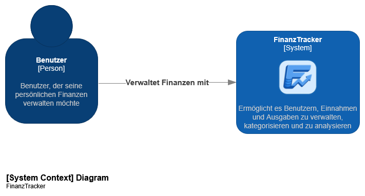
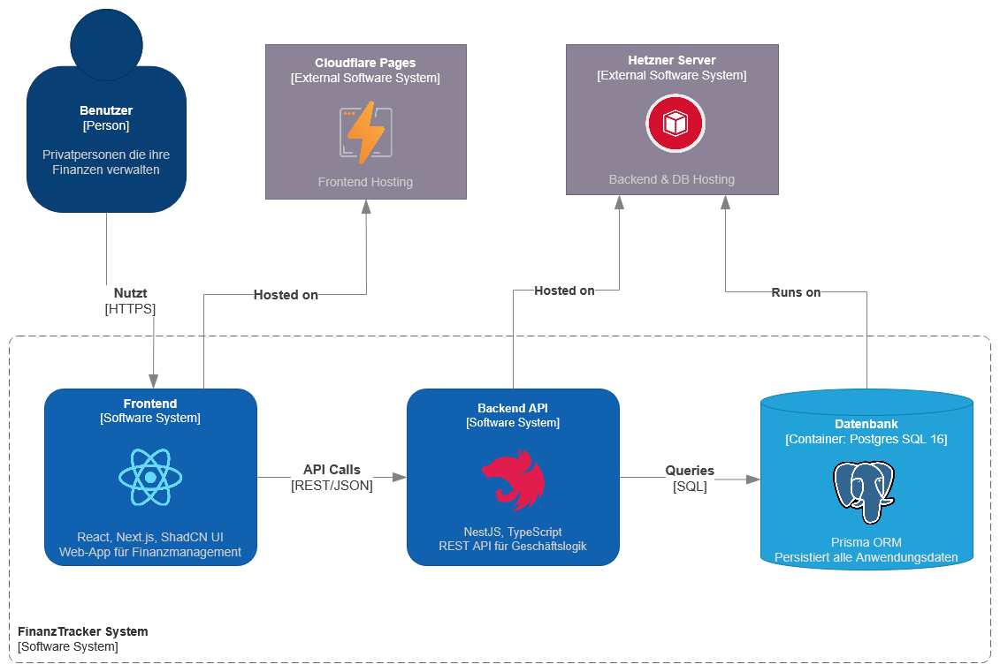

include::../_includes/default-attributes.inc.adoc[]

= Entwicklerdokumentation {project-system-name}
{localdatetime}
:toc:
:sectnums:
:icons: font

== Zweck
Unterstützt künftige Entwicklerinnen und Entwickler bei Wartung und Weiterentwicklung. Verweist auf bestehende Artefakte (Architecture Notebook, Design-Dokumente) und ergänzt sie um Build-/Dokuausleitung.

== Architekturtreiber (Kurzüberblick)
* Plattformunabhängigkeit via Web (Next.js) und Headless API (NestJS)
* Sicherheit: JWT-Auth, HTTPS, Trennung von Frontend/Backend
* Wartbarkeit: Modulstruktur im Backend, generierter API-Client im Frontend
* Performance: SSR/SSG im Frontend, ORM (Prisma) + Query-Builder (Kysely)
* Skalierbarkeit: getrennte Deployments (Frontend CDN, Backend VPS/Container)

== Systemarchitektur (C4)
=== Kontext (Level 1)

=== Container (Level 2)

=== Komponenten (Level 3, Auszug)
Siehe Architecture Notebook für vollständige Auflistung der Frontend- und Backend-Komponenten. Wichtige Backend-Komponenten: Controllers (Auth, User, Category, Entry, Analytics), Services (Auth, User, Category, Entry, Analytics), Data-Layer (Prisma/Kysely), Security (JwtAuthGuard/JwtStrategy).

== Technische Entscheidungen (Begründet)
* Programmiersprachen: TypeScript (Frontend/Backend) für Typsicherheit.
* Frameworks: Next.js 15 (SSR/SSG, Routing), NestJS 11 (DI, Module, Swagger), Prisma ORM + Kysely (typsichere DB-Zugriffe), Redis optional für Cache.
* Datenbank: PostgreSQL 16 (ACID, Open Source).
* API-Stil: REST mit OpenAPI/Swagger-Doku (`/api`, `/api-json`).
* Build/Deploy: pnpm Monorepo; Frontend als Static Export; Backend als Node-Service/Container.

== Schnittstellen (REST / OpenAPI)
* Basis-URL Backend (dev): http://localhost:3111
* Swagger UI: http://localhost:3111/api
* OpenAPI JSON: http://localhost:3111/api-json (wird für den generierten Frontend-API-Client verwendet)
* Auth: JWT Bearer; Public Endpunkte nur wo explizit erlaubt.

== Zusammenarbeit der Komponenten (Sequenzdiagramme)
Die folgenden Sequenzen stammen aus den bestehenden PlantUML-Modellen im Design-Dokument. Die Diagramme sind in den PlantUML-Dateien unter docs/development/plantuml/ zu finden und können mit PlantUML oder Online-Viewern (z.B. http://www.plantuml.com/plantuml/uml/) angezeigt werden.

=== Tasks 161/162
* PlantUML-Quelle: docs/development/plantuml/U18_161_162_seq.puml
* Zeigt den Importflow für Bankdaten (CSV/TXT), Duplikatprüfung und Persistierung

=== Tasks 163/164
* PlantUML-Quelle: docs/development/plantuml/U20_163_164_seq.puml
* Zeigt die Verfügbares-Kapital-Berechnung (aktuelle Balance, zukünftige Einnahmen, fixkosten)

=== Tasks 165/166
* PlantUML-Quelle: docs/development/plantuml/U20_165_166_seq.puml
* Zeigt Notgroschen-Verwaltung (Display, Edit, Persistierung)

== Softwaredokumentation (HTML)
Ziel: Klassen/Module, Funktionen und Parameter automatisch extrahieren. Werkzeuge bewusst einsetzen, keine manuelle Listenpflege.

=== Backend (NestJS) mit Compodoc
. Installieren (lokal, falls nicht vorhanden):
+
----
pnpm -C src/backend dlx @compodoc/compodoc -p tsconfig.json -d docs/compodoc
----
. Dokumentation bauen:
+
----
pnpm -C src/backend dlx @compodoc/compodoc -p tsconfig.json -d docs/compodoc --silent
----
. Ergebnis: HTML unter `src/backend/docs/compodoc/index.html` mit Modulen, Controllern, Services und allen Methoden.

=== Frontend (Next.js) mit TypeDoc
. Generierung (Headless, EntryPoints nach Bedarf anpassen):
+
----
pnpm -C src/frontend dlx typedoc --entryPointStrategy expand --entryPoints src --tsconfig tsconfig.json --out docs/typedoc
----
. Ergebnis: HTML unter `src/frontend/docs/typedoc/index.html` mit Komponenten/Hooks und exportierten Funktionen.

== Konsistenzsicherung
* C4-Container/Komponenten gegen Module/Packages abgleichen (Backend: `src/backend/src`, Frontend: `src/frontend/app`, `src/frontend/lib`).
* Sequenzdiagramme mit Integrationstests (E2E unter `src/backend/test`) und API-Routen abgleichen.
* Bei API-Änderungen: OpenAPI neu ausliefern (`http://localhost:3111/api-json`) und Frontend-API-Client regenerieren (`pnpm -C src/frontend run build:api`).

== Artefakt-Export
* PDF dieser Entwicklerdoku: `asciidoctor-pdf -r asciidoctor-diagram docs/development/entwicklerdoku.adoc`
* HTML-Softwaredoku: siehe Compodoc/TypeDoc-Schritte oben.

== Referenzen
* Architecture Notebook: docs/architecture/architecture_notebook.adoc
* Design-Dokument (Klassendiagramme/Sequenzen): docs/development/design.adoc
* PlantUML-Quellen: docs/development/plantuml
* C4-Bilder: docs/architecture/images
